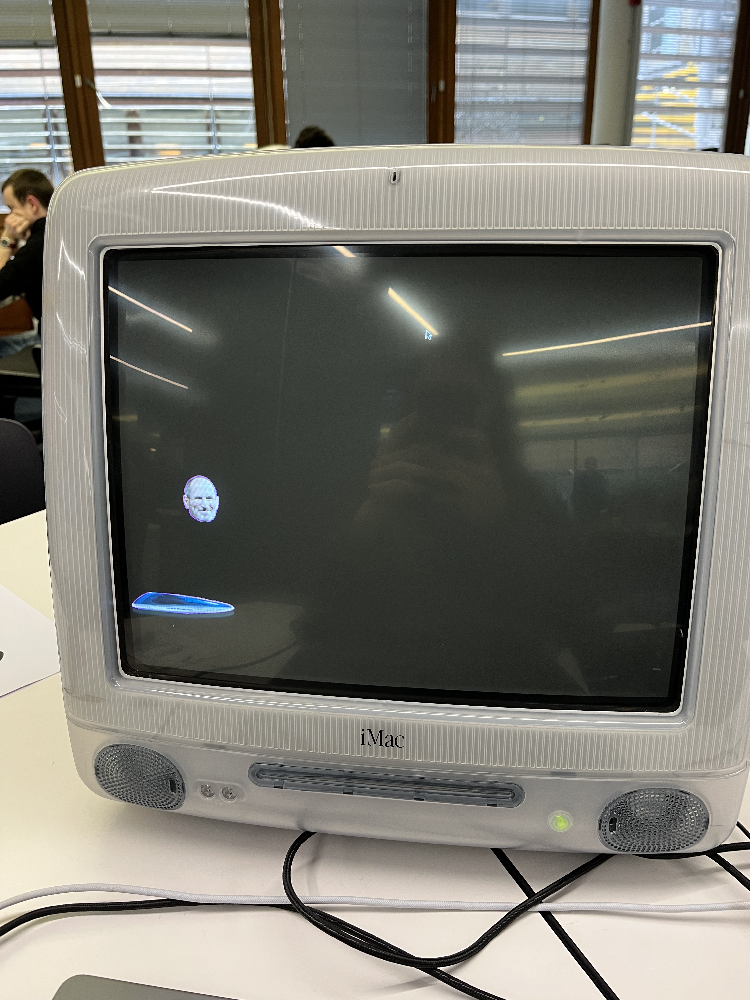

# SteveJump

SteveJump is a *very* basic attempt at a Doodlejump clone, intended to be run on G3 hardware with Mac OS 9. I made it for [HackNotts '23](hacknotts.com), and you can read more about its development at [Devpost](https://devpost.com/software/stevejump).

## Building

You should be able to build it via CodeWarrior, I used verion 8 Pro. You'll need SDL installed, which you can do by following [this guide](https://nondisplayable.ca/2017/12/20/sdl-on-classic-mac.html).